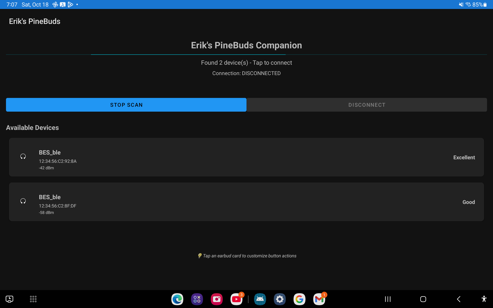

# PineBuds SDK

This is just the SDK from the wiki (so far), with dockerfile setup to make building easier, and my reverse engineered bestool integrated.
The docker image will build bestool for you first, then drop you into the dev container for building and flashing the buds.

NOTE: Currently, the SDK is not licensed under an 'open source' license. We are working to resolve this issue, and will be reaching out to contributors and other parties soon. For now, consider this SDK as 'All Rights Reserved'/'shared source'.

## ✨ New: Configurable Touch Controls via Android App

**This fork adds fully customizable touch controls for your PineBuds!**

Configure single tap, double tap, triple tap, and long press actions for each earbud independently using the companion Android app. Your custom settings are stored in the earbuds and persist across reboots.

### Features

- **📱 Android Companion App**: Easy-to-use app for configuring touch controls via Bluetooth LE
- **🎯 Per-Earbud Configuration**: Customize left and right earbuds independently
- **🔄 Persistent Storage**: Settings saved to NV flash and survive reboots
- **⚡ Real-time Updates**: Changes apply immediately to your earbuds
- **🎵 14 Actions Available**: Play/Pause, Next, Previous, Volume Up/Down, ANC Toggle, Voice Assistant, and more

### Screenshots

<p align="center">
  
  
</p>

**Left**: Device scanning and connection screen showing available BES_ble devices
**Right**: Configuration screen with customizable touch controls for each earbud

### Available Touch Actions

- Play/Pause
- Next Track
- Previous Track
- Volume Up
- Volume Down
- Toggle ANC
- Voice Assistant (Siri/Google Assistant)
- Toggle EQ
- Enter Pairing Mode
- Disconnect
- Reset Device
- Custom/None

### Quick Start

1. **Build and flash the firmware** (see Usage section below)
2. **Install the Android companion app** from `android/` directory or download the APK from releases
3. **Open the app** and connect to your PineBuds
4. **Configure your touch controls** - changes save automatically!

For detailed Android app instructions, see [android/README.md](android/README.md)

### Known Issues / Current Limitations

**BLE Configuration Service:**
- A separate BLE device appears as "BES_ble" alongside the main "PineBuds Pro" device
- The BES_ble device has **no pairing or security** - anyone can connect and modify touch control settings
- The configuration service (UUID 0xFFC0) is only available on the BES_ble device, not the main audio device
- This is a limitation of the current firmware architecture where BLE services are separate from Bluetooth Classic audio

**Future improvements:**
- Integrate BLE configuration service into main PineBuds Pro device
- Add pairing/bonding security to prevent unauthorized configuration changes
- Implement authentication or PIN-based protection for sensitive settings

## Usage

To use this setup to build & flash your PineBuds you will need a system with docker setup at the minimum.
Docker is used to (1) make this all much more reprodicible and easier to debug and (2) so that we dont mess with your host system at all.
In order to program the buds from inside of the docker container; privileged mode is used. So do be a tad more careful than usual.

```bash

./start_dev.sh # This will cause docker to start your working environment; this should take roughly 1-3 minutes depending on your network speed to the GCC hosting server

# Now you will be inside of the container, and your prompt will look akin to "root@ec5410d0a265:/usr/src#"

./build.sh # This will run make and build the output program. If you have weird build errors try running clean.sh or rm -rf'ing the out folder first

# Now that the firmware has finished building; if there are no errors you can load it to your buds

# You may want to back up the firmware currently on the buds - it will be deleted when the new firmware is loaded on:
./backup.sh

# You may need to take the buds out of the case, wait three seconds, place them back. This wakes them up and the programmer needs to catch this reboot.

# You can try the helper script by running
./download.sh

# Or do it manually by :

# Assuming that your serial ports are 0 and 1, run the following to commands to program each bud in series.
bestool write-image out/open_source/open_source.bin --port /dev/ttyACM0
bestool write-image out/open_source/open_source.bin --port /dev/ttyACM1
```

## Changelist from stock open source SDK

- **Configurable touch controls via BLE GATT service and Android companion app**
- **Per-earbud configuration with 14 available actions**
- **Persistent configuration storage in NV flash**
- Long hold (5 ish seconds) the button on the back when buds are in the case to force a device reboot (so it can be programmed)
- Use the resistor in the buds to pick Left/Right rather than TWS master/slave pairing
- Pressing the button on the back while in the case no longer triggers DFU mode
- Debugging baud rate raised to 2000000 to match stock firmware
- Fixed TWS operation such that putting either bud into the case correctly switches to the other bud
- Working (mostly) audio controls using the touch button on the buds
- Turned off showing up as a HID keyboard, as not sure _why_ you would; but it stops android nagging me about a new keyboard

## Default Touch Controls

**Note:** These are the default configurations. You can customize any of these actions using the Android companion app!

### Both pods active

#### Right Ear:

- Single tap : Play/Pause
- Double tap : Next track
- Hold : Toggle ANC(Currently non functional, WIP)
- Triple tap : Volume Up

#### Left Ear:

- Single tap : Play/Pause
- Double tap : Previous track
- Hold : Toggle ANC(Currently non functional, WIP)
- Triple tap : Volume Down

### Single pod active

- Single tap : Play/Pause
- Double tap : Next track
- Hold : Previous track
- Triple tap : Volume Up
- Quad tap : Volume Down

## Changing audio alerts

The default audio alerts are stored in:

`config/_default_cfg_src_/res/en/`

If you want to change the alert to a custom sound, just replace the sound file you'd like to change
(ie `config/_default_cfg_src_/res/en/SOUND_POWER_ON.opus`) with your own audio file with the same base
name (ie `config/_default_cfg_src_/res/en/SOUND_POWER_ON.mp3`) and recompile with `./build.sh`!

### Language support

The `AUDIO` environment variable can be set when running the `build.sh` script to load sound files
for languages other than the default English. For example, running `AUDIO=cn ./build.sh` will load sounds files from
`config/_default_cfg_src_/res/cn/` instead of the default `en/` folder.

The current languages supported with sound files are English (`en`) and Chinese (`cn`). Other languages
(or other sets of custom sounds) may be added by adding all the correct sound files into a
`config/_default_cfg_src_/res/<custom_sounds>/` directory and building with `AUDIO=<custom_sounds> ./build.sh`.

### Blue light when connected

The firmware can be configured to either have a blinking blue light when connected or not.
Build with `CONNECTED_BLUE_LIGHT=1 ./build.sh` to enable blinking when connected,
or `CONNECTED_BLUE_LIGHT=0 ./build.sh` (or just the default `./build.sh`) to keep the LEDs off when connected.
